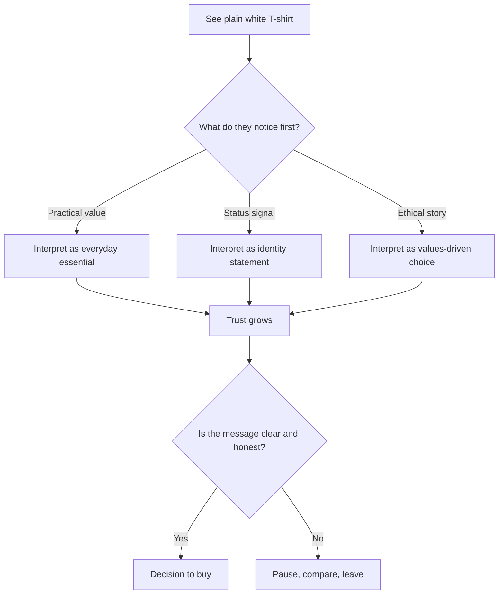

# Chapter 1: Persuasion, Branding, and Design

A plain white T-shirt is a useful reminder that persuasion is not always about changing the object itself. It is often about changing the story around the object. The shirt stays the same: cotton, shape, color, seams. What changes is how people interpret it, what they think it says about the wearer, and why they decide to buy it.

That is the heart of persuasion in design. It is not magic. It is a set of tools for shaping attention, interpretation, trust, and action.

## What Persuasion Really Is

Persuasion is the act of helping someone see a choice more clearly, feel a connection to it, and decide whether to act. In design, this can mean helping people notice a product, understand its value, trust the brand, and decide to purchase, sign up, or support something.

Persuasion is not the same as force. It does not require pressure, threats, or deception. In a healthy design context, persuasion is often about reducing confusion, clarifying benefits, and making a meaningful choice easier to make.

Think of a person walking into a store. They may be deciding between two similar T-shirts. One is presented as a basic, durable staple; the other is presented as a limited-edition statement piece. The fabric and construction may be similar, but the framing changes how the buyer interprets the value.

A designer who persuades well is often a good translator: they help people connect a product to a purpose, a value, or a social meaning they already care about.

## Persuasion, Coercion, and Manipulation

It helps to separate persuasion from coercion and manipulation.

- Persuasion gives information, context, and reasons. It invites a decision.
- Coercion uses pressure, threats, or fear to force compliance.
- Manipulation hides the real stakes, exploits confusion, or uses emotional pressure without respect for the person's agency.

A good rule: persuasion should help someone make a more informed choice; coercion and manipulation bypass that process.

For example, a shirt can be described honestly as "a versatile, durable, comfortable everyday basic." That is persuasive because it gives useful information. A manipulative version might try to scare someone into buying by claiming the shirt is a necessary status symbol or by using fake scarcity to create panic.

The ethical line is not always simple, but it matters. Designers are often shaping decisions with small choices: what is presented as important, what is left out, what emotions are emphasized, what information is visible or hidden.

## Why Persuasion Matters in Design

People do not evaluate products only by their features. They also interpret them through context.

A plain white T-shirt can be framed in several different ways:

- as a clean, timeless essential for everyday life
- as a premium product made with quality materials
- as a fashion statement tied to a specific identity
- as an eco-conscious product with a social story
- as a scarce, limited-run item with urgency

The shirt is unchanged. Only the framing changes. The same garment can be sold as practical, luxurious, rebellious, ethical, or status-driven depending on what the designer emphasizes.

This is persuasion in action. It shapes attention by deciding what the audience notices first. It shapes interpretation by offering a story or value frame. It shapes trust by creating credibility and consistency. It shapes action by making the next step feel natural, desirable, or justified.

## Robert Cialdini's Principles of Influence

Robert Cialdini identified several recurring patterns in human decision-making. His work is useful because it is descriptive: it helps explain why people often say yes, follow, buy, or commit under certain conditions.

Here are the major principles in concise form:

1. Reciprocity
   - People feel compelled to return favors or kindness.
   - Example: A brand gives a free sample, and the customer feels more inclined to buy.

2. Commitment and consistency
   - People like to act in ways that match what they have already said or done.
   - Example: If a buyer selects a small option first, they may be more likely to continue toward a larger purchase.

3. Social proof
   - People look to others when deciding what is normal, safe, or desirable.
   - Example: A product page showing many positive reviews can make a buyer feel more confident.

4. Authority
   - People trust expertise and perceived competence.
   - Example: A garment described by a knowledgeable craftsperson or a brand with clear expertise may feel more credible.

5. Liking
   - People are more easily persuaded by people or brands they feel an affinity with.
   - Example: A brand that feels warm, familiar, or aligned with a customer's identity can be more persuasive.

6. Scarcity
   - People often value something more when it seems limited or time-sensitive.
   - Example: "Only a few remain" or "limited drop" can increase urgency.

These principles are not inherently unethical. They become problematic when they are used to hide information, exploit fear, or create artificial urgency.

## Beyond Cialdini: Other Helpful Ideas

Persuasion is broader than a checklist of six principles. Two additional ideas are especially relevant to design and communication.

### 1. Loss aversion

People generally feel the pain of losing something more strongly than the pleasure of gaining something equivalent. In behavioral economics, this is called loss aversion.

A designer can use this by emphasizing what a customer might miss out on, but it should be used honestly. For example, a T-shirt brand might say, "This basic is built to last, so you can stop replacing low-quality shirts." That frame is about value and avoiding waste, not fear.

A less ethical use would be to imply that a buyer will be left behind socially or professionally if they do not purchase quickly.

### 2. Framing and meaning

The way information is framed changes how it is interpreted. This is a core idea in rhetoric and communication.

A plain white T-shirt can be framed as:

- a practical essential
- a luxury object
- a marker of minimalism
- a sign of rebellion
- a product made for a sustainable lifestyle

The same shirt can support very different meanings because the message around it changes. Good design often does not invent a new product; it helps people interpret an existing product within a meaningful story.

A designer who understands framing knows that people do not just buy a product. They buy what they believe that product says about them.

## A White T-Shirt Example

Imagine a plain white T-shirt priced at $20.

If it is presented as a classic essential, the copy might say:

> Comfortable, durable, and easy to style for everyday life.

This appeals to practicality, affordability, and ease.

If it is presented as a premium product, the copy might say:

> A carefully cut, high-quality cotton staple made for long wear and refined simplicity.

This appeals to craftsmanship and status.

If it is presented as a limited-edition cultural object, the copy might say:

> A small-batch shirt made for those who prefer quiet confidence over trend-chasing.

This appeals to identity, scarcity, and social meaning.

The product has not changed. The story has.

That is why branding is not decoration. It is a way of organizing meaning.

## Comparison Table: Persuasion Principles at a Glance

| Principle | How it works | Ethical use | Misuse risk |
| --- | --- | --- | --- |
| Reciprocity | People feel motivated to return a favor or kindness. | Offer useful value, samples, or genuine help. | Guilt-tripping or creating obligations people did not ask for. |
| Commitment and consistency | People prefer choices that match their prior commitments. | Ask for small, voluntary steps that align with user values. | Pressuring people to keep agreeing after initial hesitation. |
| Social proof | People look to others to decide what is acceptable or desirable. | Show real evidence and clear context. | Fake testimonials, misleading popularity, or pressure by false consensus. |
| Authority | People trust expertise and credibility. | Share relevant expertise and transparent standards. | Pretending to be an expert or relying on perceived authority without substance. |
| Liking | People respond more positively to familiar or relatable messages. | Build genuine connection with audience needs and values. | Manipulating affinity or using flattery to hide weak product claims. |
| Scarcity | Limited availability increases urgency. | Use real limits and honest time pressure. | Fake scarcity, countdowns, or fear-based urgency that distort reality. |
| Loss aversion | People react strongly to the prospect of missing out. | Highlight real benefits and practical losses honestly. | Creating panic, exaggerating risk, or exploiting insecurity. |
| Framing | The same information changes meaning depending on how it is presented. | Frame choices around values, clarity, and context. | Distorting meaning to make a decision seem better than it is. |

## A Simple Decision Journey

This diagram is simple, but it reflects a real design truth: people do not only decide on product features. They make meaning from context, story, and trust.

## Ethical Cautions

Persuasion is a powerful tool, so it must be used carefully.

Designers should be cautious when they:

- hide important information behind emotional language
- create fake urgency to push a decision before people have time to think
- rely on fear, shame, or insecurity rather than genuine value
- use social proof or authority without evidence
- tailor persuasive messages to vulnerable audiences without transparency

Ethical persuasion does not mean being bland. It means being honest, respectful, and clear. A persuasive message should not trick people into buying something they would not choose if they had all the relevant information.

Good persuasion respects a person's ability to decide.

## Questions to Ask Before Trying to Persuade

Before designing a persuasive message, a designer should ask:

- Who is this for, and what do they already value?
- What problem or desire is this message connecting to?
- Are we appealing to genuine needs, or are we creating artificial urgency?
- What information are we leaving out, and why?
- Are we relying on emotion without enough substance?
- What kind of trust are we building with this message?
- Is this message honest enough that the customer would still feel confident after the purchase?
- Would this still feel fair and respectful if the audience saw all of the context?

These questions matter because persuasion is not just about increasing conversion. It is also about whether the message helps people make a decision that matches their real interests.

## Explore Further

If you want to go deeper, search for:

- Cialdini principles of influence explained simply
- loss aversion in marketing and design
- framing effects in communication and product design
- ethical persuasion versus manipulation
- how branding changes meaning without changing the product

## What You Should Remember

Persuasion is a tool for shaping attention, interpretation, trust, and action. It can help people understand value and make better choices when it is honest and respectful.

The same object can be framed in many ways. A plain white T-shirt is not powerful because it changes; it is powerful because a designer can attach meaning to it through language, context, and brand story.

Cialdini's principles are useful, but they are not a shortcut for good judgment. Persuasion becomes ethical when it respects the audience, uses real information, and helps people decide with clarity rather than confusion or pressure.

Design is not just about making something look attractive. It is also about making meaning legible and decisions more informed.
