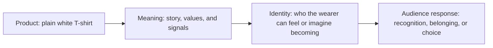

# Chapter 2: Brand Archetypes and Meaning

A product can be useful before it has a brand, but branding helps people understand what the product means. A plain white T-shirt may keep someone warm, provide a comfortable layer, or complete an outfit. It can also suggest simplicity, independence, belonging, quality, or creativity depending on the story around it.

Brand archetypes are one practical framework for building that story. They help designers ask what an audience gets to feel, imagine, or become by choosing a product, organization, or experience.

## What Is a Brand Archetype?

An archetype is a generalized cultural and narrative pattern. In branding, it is a recognizable way of expressing a brand's purpose, personality, and relationship with its audience. An archetype can guide choices about language, imagery, product details, service behavior, and the situations a brand shows people entering.

For example, an Explorer brand might emphasize independence, discovery, and movement. A Sage brand might emphasize knowledge, evidence, and understanding. These patterns give a brand a coherent point of view. They do not replace a product's actual quality or invent a reason for people to care; they organize the meaning that the brand communicates.

The practical question is:

> What does the audience get to feel, imagine, or become by choosing this brand?

The answer should connect to something real. A brand can invite people to feel capable, cared for, free, or included, but the experience should support that invitation. Archetypes are most useful when they make a product's value easier to recognize rather than covering up a weak product.

## Common Brand Archetypes

The following set is useful because it covers different kinds of audience relationships. The descriptions are starting points, not formulas.

| Archetype | Central desire | Audience invitation | Typical signals |
| --- | --- | --- | --- |
| Explorer | Freedom and discovery | Go somewhere new and define your own path. | Open spaces, movement, practical independence, invitations to experiment. |
| Sage | Understanding and truth | Learn, question, and make an informed choice. | Evidence, explanation, precision, calm authority. |
| Creator | Making something original | Express an idea and bring it into the world. | Craft, process, originality, unusual combinations. |
| Ruler | Order and excellence | Take control and set a high standard. | Structure, polish, leadership, confidence. |
| Caregiver | Support and protection | Feel looked after and help others feel secure. | Warmth, reliability, service, reassurance. |
| Rebel | Change and independence | Challenge an expectation and refuse the default. | Contrast, provocation, anti-conformity, direct language. |
| Hero | Courage and achievement | Overcome a challenge and become more capable. | Effort, progress, resilience, clear goals. |
| Everyperson | Belonging and connection | Be part of an ordinary, welcoming community. | Familiarity, accessibility, shared routines, inclusive language. |
| Innocent | Safety and optimism | Return to what feels simple, good, and trustworthy. | Lightness, clarity, openness, uncomplicated pleasure. |
| Jester | Enjoyment and play | Loosen up, laugh, and see things differently. | Humor, surprise, energy, playful reversals. |
| Lover | Connection and appreciation | Feel attraction, pleasure, or deep attention. | Sensory detail, intimacy, beauty, devotion. |
| Magician | Transformation and possibility | Imagine that a new way of being is possible. | Before-and-after stories, wonder, reinterpretation, possibility. |

These archetypes overlap. A brand could be primarily a Creator with a Sage tendency, or an Everyperson brand could use Jester-like humor. The value of the framework is not choosing one permanent label. The value is making the intended meaning more deliberate and consistent.

## The Same Shirt, Different Meaning

Imagine one identical plain white T-shirt: the same cut, color, and material. Its archetype changes through its name, photography, setting, writing, retail experience, and the behavior the brand encourages. The physical object remains constant, but the audience's interpretation can change.

### Explorer: The Shirt for the Open Road

The Explorer version is shown in motion: packed lightly, worn on a train, or layered for a changing day. The message is that the shirt is a dependable starting point for going somewhere new.

**Audience meaning:** “This helps me stay ready for my own path.”

The language might focus on versatility, movement, and self-direction. The shirt is not presented as a uniform or a status symbol. It becomes a tool for independence.

### Sage: The Shirt as a Studied Essential

The Sage version explains its construction carefully. It gives clear information about the fabric, fit, care, expected wear, and design decisions. The presentation is calm and precise rather than dramatic.

**Audience meaning:** “I understand this choice, and I can trust my judgment.”

Here, the shirt represents thoughtful selection. The brand earns confidence by making the reasoning behind the product legible.

### Rebel: The Shirt That Rejects the Default

The Rebel version treats the white T-shirt as a way to question fashion's pressure to chase every trend. Its message might contrast the quiet shirt with loud expectations about constant novelty.

**Audience meaning:** “I can refuse unnecessary rules and choose for myself.”

The shirt is still plain, but plainness becomes defiance. The brand might use blunt language, unexpected placement, or an intentionally non-glamorous setting to make the point.

### Caregiver: The Shirt That Fits Real Life

The Caregiver version focuses on comfort, reliability, and being prepared for ordinary responsibilities. It shows the shirt in routines shared with other people: work, rest, errands, or caring for family.

**Audience meaning:** “I can count on this, and I can make daily life a little easier.”

In this version, the shirt's meaning comes from dependable support rather than novelty or status.

### Creator: The Shirt as a Blank Starting Point

The Creator version treats the shirt as a canvas or foundation. It may be paired with customization, styling experiments, photography, or stories about making something distinct from a simple base.

**Audience meaning:** “I can turn a simple starting point into something that feels like mine.”

The identical shirt now invites authorship. The product's blankness is not a lack of identity; it is room for the audience to add identity.

## Comparison Table: Five Positions for One Product

| Archetype | Story about the identical shirt | Audience gets to feel, imagine, or become | Useful design choices |
| --- | --- | --- | --- |
| Explorer | A reliable layer for a self-directed journey. | Free, prepared, and open to discovery. | Travel settings, movement, adaptable styling, language about choice. |
| Sage | A carefully explained essential chosen with evidence. | Informed and confident in judgment. | Material details, diagrams, measured copy, transparent comparisons. |
| Rebel | A refusal to chase needless trends. | Independent and willing to challenge defaults. | Direct language, sharp contrast, unconventional context. |
| Caregiver | A dependable garment for real daily needs. | Supported, comfortable, and ready to care for others. | Warm scenes, practical information, reassuring service. |
| Creator | A simple base for personal expression. | Inventive, capable, and authorial. | Customization, process imagery, styling experiments, invitations to make. |

This comparison shows why archetype is not a property hidden inside the shirt. It is a relationship between the object, the brand's choices, and the audience's interpretation.

## From Product to Identity

Brand meaning usually develops in a sequence. The product provides a material starting point. The brand gives that starting point a story and a pattern of behavior. The audience then uses the meaning to imagine an identity or social role.

The sequence is not automatic. If the product experience contradicts the story, the meaning becomes less credible. A brand that presents a shirt as dependable but makes its quality or service unreliable creates a mismatch. Consistent meaning comes from the combined effect of product, communication, and experience.

## Archetypes Are Not Destiny

Archetypes are models, not literal personality diagnoses. They are simplified tools for thinking about patterns in stories, cultures, and audience expectations. A brand is not a human being with a fixed psychological type, and a customer is not required to fit one category.

A person or brand may contain multiple tendencies. A clothing company could combine the Sage's care with the Creator's originality. A single campaign could use Hero language for a challenge while maintaining a Caregiver tone in customer service. The important question is whether the combination is understandable and supported by the experience.

Cultural context matters too. A symbol that feels independent in one community may feel selfish or unfamiliar in another. Humor, authority, luxury, simplicity, and rebellion can carry different meanings across places and groups. Designers should test interpretations with the intended audience instead of assuming that an archetype has one universal meaning.

Archetypes should therefore guide inquiry, not end it. They help a team notice patterns and make choices. They do not diagnose a person's character, guarantee an audience reaction, or excuse stereotypes.

## Questions to Ask When Choosing an Archetype

Before choosing an archetype, ask:

- What does the audience get to feel, imagine, or become by choosing this brand?
- What real product benefit or experience supports that meaning?
- Which audience need, desire, or tension is this archetype helping us address?
- What behavior would make this archetype believable after the purchase?
- Which words, images, materials, and interactions would reinforce the pattern?
- What other archetype tendencies are present, and do they clarify or confuse the message?
- How might this meaning change across cultures, communities, or situations?
- Are we inviting identity and belonging, or are we pressuring people to prove their worth?
- What evidence would show that the audience understands the intended meaning?

These questions keep archetypes connected to design decisions. They also prevent a team from choosing a dramatic label and then leaving the actual product experience unchanged.

## Ethical Cautions

Brand meaning can help people find products that fit their values, but it can also exploit insecurity. Designers should be careful when a message implies that someone is inadequate, excluded, or unworthy without the product. Identity-based branding becomes especially risky when it uses stereotypes, hides important information, or suggests that buying is the only way to belong.

A responsible archetype strategy gives people an invitation, not a threat. It lets an audience recognize a possible identity without claiming that the product can transform every part of a person's life. Clear product information and honest limitations still matter.

## What You Should Remember

Brand archetypes are practical models for attaching recognizable meaning to products, organizations, and experiences. They help a team decide what an audience should feel, imagine, or become through an interaction with the brand.

The same plain white T-shirt can be an Explorer's dependable travel layer, a Sage's carefully understood essential, a Rebel's rejection of trend pressure, a Caregiver's reliable daily support, or a Creator's blank starting point. The shirt stays the same; the surrounding story and experience change what it means.

Archetypes are not destiny, personality diagnoses, or rigid categories. They are culturally shaped tools that should be tested against real products, real audiences, and real consequences. Good branding makes meaning clearer without pretending that one object can define a whole person.