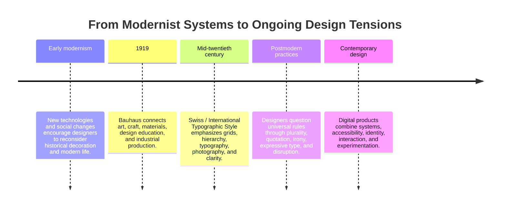

# Chapter 3: Modernism, Postmodernism, and Visual Language

Visual design does more than arrange attractive shapes. It communicates ideas about order, authority, speed, tradition, identity, and possibility. A layout can feel calm or urgent. A typeface can feel official or playful. A product photograph can make an object seem ordinary, technical, luxurious, or strange.

This chapter follows a broad path from early modernism through Bauhaus and the Swiss / International Typographic Style, then considers postmodernism as a challenge to some modernist assumptions. The goal is not to memorize a list of styles. It is to learn how formal choices carry meaning and how the same tensions continue in contemporary digital design.

## What Is Visual Language?

Language uses words, grammar, rhythm, and tone to communicate. Visual language works through choices such as:

- layout and spacing
- typeface, scale, and weight
- color and contrast
- images, symbols, and materials
- alignment, repetition, and hierarchy
- motion, interaction, and feedback

These choices create expectations. A strict grid may suggest reliability and institutional order. An irregular composition may suggest energy, individuality, or resistance. Neither choice has one permanent meaning. Meaning depends on context, culture, audience, and what the design is asking people to do.

## A Short Path into Modernism

Modernism was not one single style or one unified movement. It describes a range of efforts to respond to industrialization, new technologies, changing cities, and modern social life. Many modernist designers looked for forms that felt current rather than copied from historical decoration.

Across different modernist practices, several ideas often appear:

- **Reduction:** remove elements that do not support the purpose.
- **Function:** let use, construction, or communication guide form.
- **Hierarchy:** make the order of information easy to understand.
- **Clarity:** reduce unnecessary confusion and make a message legible.
- **System:** use repeatable rules so a design can work across many situations.

These ideas could make design more accessible and adaptable, but they also carried assumptions. A system that claims to work for everyone may overlook local histories, individual identities, or unequal access. The history of modernism is therefore useful not because it offers a final answer, but because it gives us a powerful set of choices to examine.

## Bauhaus: Combining Art, Craft, and Industry

The Bauhaus school was founded in Germany in 1919. It brought together approaches to art, craft, architecture, and design and encouraged students to think about materials, making, form, and modern life. Its work is often associated with experimentation, geometric forms, functional thinking, and the relationship between design education and industrial production.

It is important not to reduce Bauhaus to a collection of visual ingredients such as rectangles, primary colors, or sans-serif type. Its larger lesson was methodological: design could be studied, tested, made, and connected to everyday life. Questions about materials, construction, function, and production mattered alongside appearance.

The Bauhaus example also shows why design history needs context. Institutions contain many people, practices, and disagreements. A movement is more complicated than the simplified style label that later textbooks may attach to it.

## Swiss / International Typographic Style

The Swiss / International Typographic Style developed in the mid-twentieth century and is commonly associated with clear hierarchy, asymmetrical layouts, sans-serif typography, photography, and modular grids. Designers used organized relationships between columns, margins, text, and images to make information easier to navigate.

The grid is not merely a set of visible lines. It is an underlying structure that helps a designer place elements consistently. A grid can create rhythm, alignment, and a sense that information belongs to a coherent system. It can also be adjusted, interrupted, or hidden while still guiding the composition.

This approach became influential in posters, publications, identity systems, signage, and other forms of communication. It often suggests that information should be direct and that visual decoration should not compete with the message. That clarity can be useful, but it is still a designed point of view rather than a neutral absence of style.

## A Timeline of Design Arguments

The timeline below is intentionally broad. It shows a sequence of influential conversations, not a neat replacement of one style by another.

## Postmodernism as a Challenge

Postmodern design emerged through varied practices rather than one replacement style. In broad terms, it challenged modernist certainty, restraint, universality, and order. Designers and theorists questioned whether one clean system could represent every audience or whether function could ever be separated from culture, history, and interpretation.

Postmodern approaches may use:

- plurality instead of one universal visual rule
- irony instead of unquestioned seriousness
- quotation and historical reference instead of total newness
- expressive or unstable typography instead of uniform legibility
- layering and abundance instead of reduction
- disruption of the grid instead of invisible regularity

These choices can make identity, conflict, humor, and cultural reference visible. They can also become confusing or decorative when they are used without purpose. Postmodernism is not simply “messy design,” just as modernism is not simply “clean design.” Both include arguments about what design should do and whom it should serve.

## The Tensions Are Still Active

Contemporary design has not moved neatly from modernism to postmodernism and then stopped. Designers continue to combine, revise, and argue through these approaches.

| Tension | One side emphasizes | The other side emphasizes | Contemporary question |
| --- | --- | --- | --- |
| Order and disruption | Predictability, rhythm, and control. | Surprise, interruption, and energy. | When should a user feel oriented, and when should they be invited to notice something new? |
| Universality and identity | Shared rules that travel across contexts. | Local experience, difference, and representation. | Whose needs are treated as the default? |
| Clarity and expression | Fast comprehension and legibility. | Voice, mood, ambiguity, and personality. | What must be immediately understood, and what can be explored? |
| Grid and anti-grid | Alignment, consistency, and scalable structure. | Layering, asymmetry, and visible independence. | Where does structure help, and where does it limit the message? |
| Restraint and abundance | Fewer elements and focused attention. | Richness, reference, and multiple signals. | Is the experience calm enough to use but rich enough to feel meaningful? |
| Function and irony | Direct purpose and sincere communication. | Self-awareness, humor, and critique. | Can the design question its own conventions without hiding what it does? |

The best choice depends on the situation. A medical interface may need strong hierarchy and predictable navigation, while a cultural event may use ambiguity and visual interruption to create curiosity. Even then, a functional product can have personality, and an expressive product still needs usable structure.

## Contemporary Web and Product Design

These tensions appear every day in digital work.

### Order in a digital product

A budgeting tool might use a consistent grid, clear labels, repeated controls, restrained color, and strong hierarchy. These choices help users compare information and complete tasks. The visual language says that the system is dependable and that the next action can be found.

### Disruption in a digital experience

A cultural website might use oversized type, unexpected movement, overlapping images, or a deliberately unusual navigation pattern. These choices can communicate experimentation or a distinctive point of view. They also create a responsibility: novelty should not prevent people from understanding where they are or what they can do.

### Combining the approaches

Many successful interfaces use a stable underlying system with expressive moments on top. A site can use a grid for structure, distinctive type for identity, animation for emphasis, and enough contrast for accessibility. The design tension is productive when each choice has a job.

Design systems make this especially visible. Shared components, spacing rules, and accessible interaction patterns express modernist ideas about consistency and scale. Custom illustrations, local language, inclusive imagery, and playful transitions introduce identity and expression. Contemporary design often works through this combination rather than choosing one side permanently.

## How to Read a Design

When you encounter a poster, website, product package, app screen, or object, read it in stages.

1. **Describe before judging.** List what you can observe: alignment, type size, color, image treatment, spacing, repetition, movement, and materials.
2. **Find the hierarchy.** What do you notice first, second, and third? How does the design guide your attention?
3. **Look for the system.** Is there a grid, repeated pattern, consistent spacing, or set of components? Where does the design follow or break its system?
4. **Notice the voice.** Does the design feel formal, technical, warm, playful, urgent, luxurious, familiar, or confrontational? Which choices create that feeling?
5. **Ask who is centered.** What audience seems expected? What language, body, culture, ability, or experience is treated as normal?
6. **Connect form to purpose.** What does the design help someone understand, feel, remember, or do?
7. **Test the tradeoff.** What does the design gain through its approach, and what might it make harder?

This method keeps visual criticism specific. Instead of saying only “it looks modern” or “it feels chaotic,” you can explain which choices produce that impression and whether those choices serve the intended audience.

## The Same White T-Shirt, Two Visual Languages

Consider the same plain white T-shirt shown in two different presentations.

A **modernist presentation** might photograph the shirt against a plain background, align information in a measured grid, use restrained typography, and show details such as dimensions, fabric, or construction clearly. The shirt may feel efficient, timeless, rational, and carefully made. The design language makes the product easy to compare and understand.

A **postmodern presentation** might crop the shirt unexpectedly, layer type over the image, combine references to different eras, use an irregular layout, or make a self-aware joke about the idea of a “basic.” The shirt may feel culturally situated, ironic, expressive, or deliberately ordinary. The design language asks the audience to interpret the product as well as inspect it.

The T-shirt has not changed. The visual language changes the expectations around it. One presentation emphasizes order and clarity; the other emphasizes identity, quotation, disruption, or irony. Either can work, but each creates a different relationship between object and audience.

## Museum Research

Use museum and institutional collections to find authentic examples rather than relying on invented examples or unsourced images. Possible places to search include:

- The Metropolitan Museum of Art
- MoMA
- Cooper Hewitt
- V&A
- Bauhaus archives
- other museum, university, library, or cultural-institution collections

These are starting points for research, not a list of specific objects to assume. Search the institution's own collection interface and verify the actual object, date, maker, location, medium, and description yourself.

Useful search terms include:

- early modernist graphic design
- Bauhaus design typography
- Bauhaus furniture or product design
- Swiss International Typographic Style
- modernist grid poster
- postmodern graphic design typography
- experimental typography
- design system and visual identity

As you research, record the collection name, object title, maker or designer if listed, date if listed, and the evidence that supports your interpretation. Do not claim that an object represents an entire movement based on appearance alone. Compare the institution's description with what you can observe, and label your own interpretation as interpretation.

## What You Should Remember

Visual design carries ideas through structure, type, image, color, material, and interaction. Modernist traditions often emphasize reduction, function, hierarchy, clarity, and systems. Bauhaus connected design education with art, craft, materials, and modern production. The Swiss / International Typographic Style made grids, asymmetry, typography, photography, and information hierarchy especially influential.

Postmodern approaches questioned the certainty, restraint, universality, and order associated with some modernist practices. They made more room for plurality, identity, quotation, irony, disruption, and expressive typography. Neither approach is a universal solution.

The central lesson is the continuing tension between order and disruption, universality and identity, clarity and expression, grid and anti-grid, restraint and abundance, and function and irony. Contemporary web and product design keeps negotiating these tensions. A plain white T-shirt can feel like a different product when its visual language changes, even though the object itself remains the same.