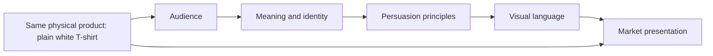

# Chapter 4: The Plain White T-Shirt Case Study

Here is the challenge: take one ordinary, high-quality plain white T-shirt and make it feel like four different products without substantially changing the shirt itself.

The shirt has the same basic physical description in every concept:

- white fabric
- a simple everyday cut
- durable construction
- no printed graphic on the front
- the same imaginary product underneath the presentation

What changes is the market presentation: the audience, story, visual language, persuasive emphasis, and identity the shirt offers. This is not a trick. It is a way to see how branding and design turn product features into meaning.

## Concept 1: The Open Route

**Audience:** People who value independence, flexible plans, and clothing that can move between different parts of a day.

**Chosen brand archetype:** Explorer.

**Persuasion principles being used:** Framing, liking, and commitment and consistency. The shirt is framed as a reliable starting point for self-directed activity. The brand invites people who already value flexibility to make a small purchase consistent with that value.

**Visual-design language:** Spacious photography, natural light, a restrained palette, practical details, and layouts that suggest movement across a page. The design is organized enough to be useful but leaves room around the object.

**Headline:** `Start anywhere.`

**Short product story:** The shirt is the first thing packed and the last thing that needs explaining. It works under a jacket, beside a backpack, or on an unplanned afternoon away from home. Its value is not that it promises an extraordinary life; it is that it does not get in the way of one.

**Imagery direction:** Show the shirt in transitional places such as a doorway, a station, a trailhead, or a shared workspace. Include a packed bag, changing weather, and several ways to layer it. Avoid pretending that the shirt itself creates adventure.

**Meaning the customer is invited to buy:** “I am ready to choose my own direction.” The customer is buying a feeling of preparedness and freedom, not merely cotton and seams.

**Ethical concern or possible misuse:** Explorer language can romanticize constant travel or make ordinary routines seem like failure. The brand should not imply that people need to leave home, spend more, or perform a particular lifestyle to be independent.

## Concept 2: The Measured Essential

**Audience:** People who want to compare products carefully and appreciate clear information, consistency, and understated quality.

**Chosen brand archetype:** Sage.

**Persuasion principles being used:** Authority, framing, and commitment and consistency. The presentation earns trust through specific product information and positions a careful purchase as an expression of thoughtful judgment. It should rely on real product evidence, not vague claims of superiority.

**Visual-design language:** Restrained modernist and Swiss-influenced design: an asymmetrical grid, clear hierarchy, sans-serif typography, generous margins, limited color, and carefully aligned product diagrams. The page makes the shirt easy to inspect and compare.

**Headline:** `A clear answer to a daily question.`

**Short product story:** Many wardrobes need a dependable white shirt. This version does not try to make the basic seem mysterious. It explains the fit, fabric, construction, care, and intended use so the customer can decide whether the shirt actually belongs in their routine.

**Imagery direction:** Use a front view, back view, close details of seams, a simple measurement graphic, and a neutral studio photograph. Keep the image scale and captions consistent. Let the information carry the drama.

**Meaning the customer is invited to buy:** “I make informed choices and know why this one works for me.” The shirt becomes a symbol of discernment and calm control.

**Ethical concern or possible misuse:** A technical layout can create an impression of authority without enough evidence. The brand must not use precise-looking diagrams, invented performance claims, or specialist language to make an ordinary product seem objectively best for everyone.

## Concept 3: The Basic Is the Rebellion

**Audience:** Trend-weary shoppers, independent stylists, and people who enjoy questioning the expectations attached to fashion and consumption.

**Chosen brand archetype:** Rebel.

**Persuasion principles being used:** Framing, reactance, and liking. The shirt is framed as a refusal to chase every new trend. The message invites people to resist a familiar pressure, while a distinctive tone creates affinity with an audience that enjoys skepticism and wit.

**Visual-design language:** Disruptive and postmodern. Use cropped photographs, clashing type sizes, unexpected captions, layered references, visible edits, and interruptions to the grid. The page may look like several design traditions are arguing with one another. The shirt remains visually plain, which makes the surrounding noise part of the joke.

**Headline:** `The shirt has nothing to prove.`

**Short product story:** The shirt arrives without a dramatic graphic, a seasonal color, or a demand that the wearer keep up. The presentation exaggerates the machinery of fashion around it, then lets the plain shirt sit there and decline to participate.

**Imagery direction:** Pair a straightforward product photograph with deliberately awkward crops, oversized warning-like labels, and playful contradictions. A formal product detail might sit beside a deliberately unserious caption. The visual disruption should clarify the critique rather than merely create visual clutter.

**Meaning the customer is invited to buy:** “I can choose simplicity on my own terms.” The purchase becomes a small act of independence from trend pressure.

**Ethical concern or possible misuse:** Rebellion can become another status signal. A brand should not claim that buying its supposedly anti-fashion shirt makes someone more authentic or morally superior than other people. Irony can also hide weak product information, so the actual shirt still needs to be described plainly.

## Concept 4: The Shirt Everyone Can Use

**Audience:** People looking for a comfortable, dependable wardrobe staple and a brand that feels welcoming rather than intimidating.

**Chosen brand archetype:** Everyperson with a Caregiver tendency.

**Persuasion principles being used:** Liking, social proof, and reciprocity. The presentation uses familiar situations and inclusive language to create recognition. Real customer experiences could provide social proof, while useful care information or repair support could offer genuine value in return for attention and trust.

**Visual-design language:** Warm, accessible, and documentary. Use ordinary interiors, varied bodies and ages, readable type, soft contrast, and practical information close to the purchase decision. The design should feel inviting without pretending that everyone has the same body, budget, or routine.

**Headline:** `Good for the days you actually have.`

**Short product story:** The shirt is shown doing unglamorous but important work: getting someone ready in the morning, handling a long day, fitting into a shared laundry routine, or becoming the reliable item reached for again and again. Its identity comes from usefulness and belonging.

**Imagery direction:** Show several people styling the same shirt in different ordinary settings. Include close-ups of fit and care details, but avoid turning “real life” into a staged performance of hardship or sameness.

**Meaning the customer is invited to buy:** “I belong here, and this product can support my real routine.” The shirt offers comfort, recognition, and a sense of shared everyday life.

**Ethical concern or possible misuse:** Warmth and belonging can become exclusionary if the brand quietly defines who counts as ordinary. Do not use fake testimonials, tokenistic diversity, or emotional stories to distract from price, fit limitations, labor conditions, or care requirements.

## One Shirt, Four Market Presentations

| Concept | Audience | Archetype | Persuasive emphasis | Visual language | Meaning invited |
| --- | --- | --- | --- | --- | --- |
| The Open Route | Independent, flexible planners | Explorer | Framing, liking, commitment and consistency | Spacious, mobile, practical | I am ready to choose my own direction. |
| The Measured Essential | Careful, information-seeking buyers | Sage | Authority, framing, commitment and consistency | Restrained modernist / Swiss-influenced grid | I make informed choices. |
| The Basic Is the Rebellion | Trend-weary, skeptical shoppers | Rebel | Framing, reactance, liking | Disruptive postmodern layering and irony | I choose simplicity on my own terms. |
| The Shirt Everyone Can Use | People seeking reliable belonging | Everyperson / Caregiver | Liking, social proof, reciprocity | Warm, accessible documentary style | I belong here, and this supports my routine. |

The table makes the central lesson visible: a product presentation is a coordinated system. Changing only the headline would not create four convincing products. The audience, story, imagery, design structure, and persuasive principles have to support one another.

## How the Presentation Is Built

The physical shirt is the starting point, not the complete message. Each layer answers a different question:

- **Product:** What is materially being offered?
- **Audience:** Who is this presentation trying to help or attract?
- **Meaning:** What identity or possibility does the choice suggest?
- **Persuasion:** Why might the audience trust, want, or act on the message?
- **Visual language:** What formal choices make the message feel believable?

The arrows are not a strict recipe. A visual treatment may reveal a new audience, and audience research may change the intended meaning. The point is to make the connections visible so that a designer can ask whether the pieces agree.

## What Makes the Concepts Radically Different?

The shirt does not need to become a different object for the experiences to diverge. In the Explorer concept, its blankness supports mobility. In the Sage concept, its simplicity supports inspection and informed choice. In the Rebel concept, its blankness becomes a refusal of novelty. In the Everyperson / Caregiver concept, the same blankness makes the shirt easy to join to many routines.

These meanings can even conflict. A sparse grid may communicate control, while a broken grid may communicate resistance. A travel image may invite independence, while a group scene may invite belonging. Neither presentation is automatically better. The design question is whether the chosen meaning is useful, honest, and supported by the actual experience.

## Questions for a Designer

Before publishing one of these presentations, ask:

- What is genuinely different about the audience's situation or need?
- Which product facts support the story, and which claims are only atmosphere?
- Does the archetype invite an identity without demanding that people prove their worth?
- Do the persuasion principles clarify value or exploit anxiety?
- Does the visual language help people use and understand the product?
- What would a skeptical customer notice that the presentation leaves out?
- How could the same message be interpreted differently by another culture or community?

A strong case study does not pretend that branding changes the physical object. It shows exactly how meaning is added, what that meaning asks the audience to do, and where the presentation could become misleading.

## What You Should Remember

One imaginary high-quality plain white T-shirt can be presented as an Explorer's reliable starting point, a Sage's carefully examined essential, a Rebel's refusal of trend pressure, or an Everyperson's dependable piece of daily life. The physical shirt stays substantially the same while the audience, archetype, persuasive principles, visual language, and story change.

The most convincing presentation is not the loudest one. It is the one in which the product, audience, meaning, persuasion, and visual design agree. Good synthesis also includes ethical limits: identity should be invited rather than coerced, evidence should support claims, and visual style should not hide what the customer is actually buying.