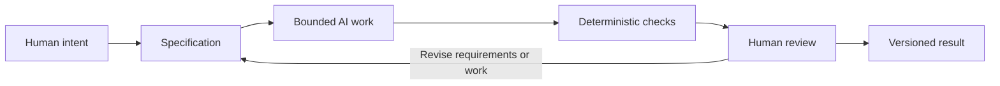

# Chapter 5: Directing Creative Work with Three Lenses

The earlier chapters studied three ways of making meaning:

- **Persuasion** asks: What response are we trying to enable?
- **Brand archetype** asks: What meaning or identity are we expressing?
- **Design language** asks: How should that meaning look and feel?

Together, these lenses form a high-level control framework. They help a designer move from a vague wish such as “make this feel better” to a clearer creative direction. They are also useful when an AI assistant is generating writing, code, layouts, images, or research plans.

## The Three-Lens Framework

### 1. Persuasion: The Intended Response

Persuasion focuses attention on what the audience should understand, feel, or do. A request might aim to help someone compare options, trust a service, join a community, try a product, or question an assumption.

This question keeps creative work connected to purpose. It also creates an ethical checkpoint: is the design helping people make a clearer choice, or is it trying to pressure them through confusion, fear, or false urgency?

### 2. Archetype: The Meaning and Identity

Archetype focuses on the role or identity a brand invites the audience to recognize. An Explorer might invite independence, while a Sage might invite careful understanding. The archetype is a model for organizing meaning, not a diagnosis of the audience or a fixed personality label.

This lens helps an AI assistant understand why a piece should sound adventurous, careful, welcoming, rebellious, or playful. It also reminds the team to consider cultural context and whether the proposed identity is supported by the actual experience.

### 3. Design Language: The Look and Feel

Design language translates meaning into formal choices. It includes layout, typography, color, imagery, materials, motion, interaction, and tone. A restrained grid can make information feel orderly and reliable. An expressive, disrupted composition can make it feel experimental or self-aware.

This lens prevents a mismatch between message and presentation. A product described as calm and trustworthy may need a different visual language from one positioned as disruptive and ironic. The choice should serve the intended response and meaning rather than being decoration added at the end.

## Applying the Lenses to an AI Request

An AI assistant can produce a polished answer to an unclear prompt, but polish does not guarantee purpose. A short framework makes the task more specific:

| Lens | Question | Example for a white T-shirt |
| --- | --- | --- |
| Persuasion | What response are we trying to enable? | Help a careful buyer compare the shirt and decide with confidence. |
| Archetype | What meaning or identity are we expressing? | Sage: the buyer is thoughtful and informed. |
| Design language | How should that meaning look and feel? | Restrained typography, clear hierarchy, a measured grid, and product details. |

The same product could produce a different result with different answers. An Explorer version might enable a feeling of readiness, express independence, and use spacious travel imagery. A Rebel version might invite resistance to trend pressure, express nonconformity, and use a disrupted postmodern layout.

The framework does not make the AI creative process automatic. It gives the process a direction that can be discussed, revised, and checked.

## Why Specifications Matter

An AI task should be bounded by a specification because an assistant needs more than a topic. A useful specification states:

- the required output and file location
- the intended audience
- the purpose or response the work should enable
- required sections, examples, or formats
- constraints such as tone, evidence, scope, or prohibited inventions
- acceptance criteria that someone can check afterward

A specification narrows the space of plausible answers. That is helpful because AI systems can generate many reasonable-sounding directions, including directions that do not solve the actual assignment. A bounded task gives the assistant a target and gives the human reviewer something concrete to evaluate.

The specification is not a substitute for judgment. It is a shared starting point. Humans may discover that a requirement is ambiguous, incomplete, or ethically uncomfortable and revise it before or during the work.

## Why Git Provides Traceability and Recovery

Git records changes to files over time. That makes AI-assisted work easier to inspect because a team can see what changed, when it changed, and which version is currently being considered.

This creates two practical benefits:

- **Traceability:** The final file can be connected to an issue, prompt, branch, review, and commit. A reviewer can ask how a particular decision entered the project.
- **Recovery:** If an AI-generated edit introduces a problem, earlier committed versions provide a way to compare, restore, or selectively revise the work.

Version control does not make an AI result correct. It makes the process more recoverable and the decisions more visible. The student or team still has to read the result and decide whether it deserves to remain.

## Deterministic Checks: Cheap and Repeatable

Some requirements can be checked mechanically. A script can test whether a file exists, whether required headings are present, whether a Mermaid fence is balanced, or whether a set of links points to the intended chapter files.

These are deterministic checks: given the same input, they should produce the same result. They are useful because they are fast, repeatable, and less tiring than asking a person to perform the same simple inspection several times.

However, a passing check is not the same as a good chapter. A file can contain every required heading and still be inaccurate, confusing, culturally careless, or badly written. Automated checks are a floor for obvious requirements, not a complete definition of quality.

## AI Review Is Useful but Probabilistic

AI can also review writing, code, structure, or clarity. It may notice a missing requirement, suggest a clearer explanation, identify repetition, or simulate questions from a beginner reader. That can make review faster and reveal issues a person had overlooked.

AI review is probabilistic, though. It can miss an error, misunderstand context, confidently recommend a weak change, or repeat an unsupported claim. Its judgment may vary with the prompt and surrounding material. Treat it as another perspective rather than as a final authority.

A sensible review sequence combines both kinds of checking:

1. Run cheap deterministic checks for visible, repeatable requirements.
2. Use AI review to generate questions, alternatives, and possible risks.
3. Read the work as a human who understands the assignment, audience, context, and consequences.
4. Revise, rerun the checks, and inspect the final version again.

## Human Review as a Race-Car Pit Stop

Imagine a race car completing lap after lap. Automation can keep the process moving: generating files, running tests, formatting text, and checking predictable conditions. But a racing team still brings the car into the pit at selected moments. People inspect what automated motion cannot fully judge, make a deliberate adjustment, and send the car back onto the track.

Human review works the same way. It should happen at meaningful checkpoints, especially before a result is published, merged, submitted, or used to affect other people. The human reviewer checks whether the work expresses the intended meaning, tells the truth, fits the context, respects the audience, and actually solves the problem.

The pit stop is not a claim that automation is useless. It is a reminder that speed and inspection serve different purposes. Automation can keep running, but selected moments deserve deliberate human attention.

## What Humans Remain Responsible For

Humans remain responsible for:

- **Judgment:** deciding whether a result is useful and appropriate
- **Meaning:** deciding what the work communicates and whether that message is worth communicating
- **Truthfulness:** checking claims, evidence, examples, and limitations
- **Context:** understanding the audience, culture, situation, and consequences
- **Final decisions:** approving, revising, rejecting, publishing, or merging the result

An AI assistant can help generate possibilities and perform useful analysis. It cannot take responsibility away from the person who directs the work and accepts the outcome.

## The Complete Workflow

The workflow below connects intention, bounded generation, validation, review, and version control.

The loop matters. A check may reveal that the specification was incomplete. Human review may reveal that the work satisfies the letter of the task but misses its meaning. Version control lets the team preserve a known state while making the next revision.

## A Compact Working Checklist

Before asking an AI assistant to work, ask:

- What response should this work enable?
- What meaning or identity should it express?
- How should that meaning look and feel?
- What exact output is required, and what is out of scope?
- Which requirements can be checked automatically?
- What claims or choices require human verification?
- Where will the result be reviewed and recorded?

After the assistant responds, ask:

- Did it produce the requested artifact in the right place?
- Did it satisfy the explicit acceptance criteria?
- Is the result truthful, clear, useful, and appropriate for its audience?
- Does the visual or verbal style support the intended meaning?
- What should be revised before the result is versioned?

## Questions for Next Week

- Which parts of your next creative or technical task can be made more specific?
- What response do you want your audience or user to have?
- What identity or meaning should the work invite without forcing it?
- Which design-language choices would support that meaning?
- What can a deterministic check verify cheaply?
- What can only a human reviewer understand through context and judgment?
- At which points should the work stop for a deliberate “pit stop” review?

## What You Should Remember

Persuasion, archetype, and design language answer three connected questions: what response are we trying to enable, what meaning or identity are we expressing, and how should that meaning look and feel?

When directing AI-assisted work, a specification turns intention into a bounded task. Deterministic checks provide cheap and repeatable validation. Git provides traceability and recovery. AI review can offer useful probabilistic feedback, but it cannot replace human responsibility for judgment, meaning, truthfulness, context, and final decisions.

The goal is not to remove people from the creative process. It is to place human attention where it matters most, like a race team making a deliberate pit stop while the larger system keeps moving.